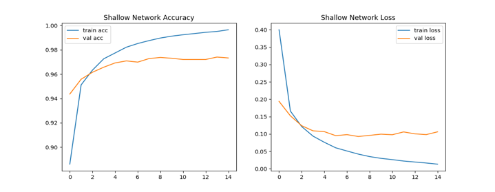
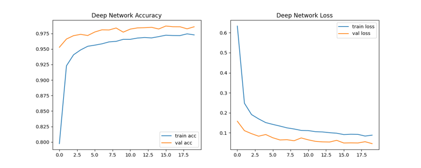

# Fashion-MNIST Classification Benchmark

This assignment compares two fully connected neural networks on the Fashion-MNIST image classification dataset.

## Project Summary

The goal is to evaluate how network depth affects accuracy, validation behavior, training time, and generalization on a simple computer vision benchmark.

The two models are:

- `shallow_model.py`: three hidden dense layers.
- `deep_model.py`: five hidden dense layers with decreasing width.

## Dataset

Fashion-MNIST contains 70,000 grayscale clothing images:

| Split | Images |
| --- | ---: |
| Training | 60,000 |
| Test | 10,000 |

Each image is resized to a flattened vector of 784 normalized values.

## Model Architectures

Shallow model:

```text
Dense(100, relu)
Dense(50, relu)
Dense(100, relu)
Dense(10, softmax)
```

Deep model:

```text
Dense(512, relu)
Dense(256, relu)
Dense(128, relu)
Dense(64, relu)
Dense(32, relu)
Dense(10, softmax)
```

## Reported Results

| Metric | Shallow Model | Deep Model |
| --- | ---: | ---: |
| Train accuracy | 0.9625 | 0.9716 |
| Validation accuracy | 0.8923 | 0.8973 |
| Test accuracy | 0.8846 | 0.8961 |
| Validation loss | 0.4713 | 0.4887 |
| Training time | 30.66 sec | 64.47 sec |

The deep model reached the best test accuracy, while the shallow model trained faster and remained competitive.

## Training Curves

Shallow network accuracy and loss:



Deep network accuracy and loss:



## Setup

From this folder:

```bash
python -m venv .venv
.venv\Scripts\activate
pip install -r requirements.txt
```

On macOS or Linux:

```bash
python3 -m venv .venv
source .venv/bin/activate
pip install -r requirements.txt
```

## Usage

Run the shallow model:

```bash
python shallow_model.py
```

Run the deep model:

```bash
python deep_model.py
```

Optional arguments:

```bash
python shallow_model.py --epochs 10 --batch-size 128 --no-plots
python deep_model.py --epochs 10 --batch-size 128 --no-plots
```

## Files

```text
classification/
|-- deep_model.py
|-- shallow_model.py
|-- requirements.txt
`-- docs/
    |-- plots/
    `-- classification_report.pdf
```

The original assignment report is stored in `docs/classification_report.pdf`.
