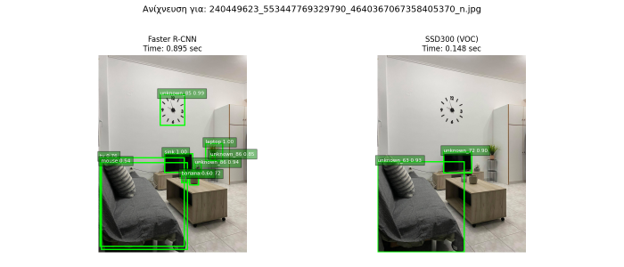
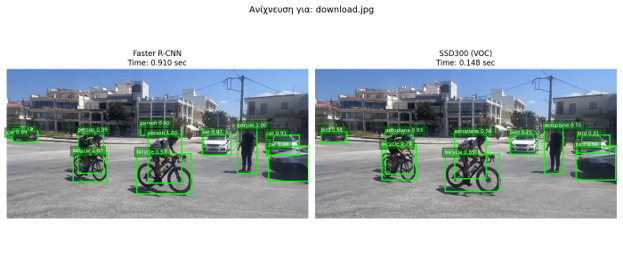

# Object Detection Benchmark

This assignment compares pretrained object detection models on a small set of real-world style images.

## Project Summary

The benchmark evaluates:

- YOLOv5m through the Ultralytics package.
- Faster R-CNN ResNet50 FPN through TorchVision.
- SSD300 VGG16 through TorchVision.

The comparison focuses on detection quality, confidence scores, inference time, number of detections, and robustness across complex scenes.

## Dataset

The `images/` folder contains 11 AI-generated images covering indoor and outdoor scenarios such as vehicles, people, workspaces, food, animals, and aircraft.

```text
object_detection/
`-- images/
    |-- coastal-reflection.jpg
    |-- cozy-home-office-with-a-thoughtful-professional.jpg
    |-- family-dinner-spread-with-a-roasted-chicken.jpg
    |-- group-of-riders-showcasing-powerful-motorbikes.jpg
    |-- luxury-vehicles-on-display.jpg
    |-- maroon-city-bus-in-motion.jpg
    |-- modern-workspace-with-natural-light.jpg
    |-- skyline-view-of-a-modern-city.jpg
    |-- sleek-mclaren-supercar-with-dapper-driver.jpg
    |-- spectacular-air-show-with-precision-aircraft.jpg
    `-- western-adventure-cowboy-canine-companion.jpg
```

## Setup

From this folder:

```bash
python -m venv .venv
.venv\Scripts\activate
pip install -r requirements.txt
```

On macOS or Linux:

```bash
python3 -m venv .venv
source .venv/bin/activate
pip install -r requirements.txt
```

The local model file `models/yolov5mu.pt` is intentionally ignored by Git because it is large. If it is missing, Ultralytics can download the model on first use when network access is available.

## Usage

Run YOLO detection:

```bash
python yolo_detect.py
```

Run Faster R-CNN only:

```bash
python faster_rcnn.py
```

Run SSD300 only:

```bash
python ssd300.py
```

Run the side-by-side Faster R-CNN and SSD300 comparison:

```bash
python faster_rcnn_ssd_compare.py
```

Useful options:

```bash
python yolo_detect.py --no-show --save-dir results/yolo
python faster_rcnn_ssd_compare.py --threshold 0.5 --no-show --save-dir results/faster_rcnn_vs_ssd
```

## Reported Findings

The assignment report concluded that YOLOv5m gave the best overall balance of speed and detection quality. Faster R-CNN produced many detections but was slower, while SSD300 was fast but missed more objects and produced weaker labels in this image set.

## Faster R-CNN vs SSD300 Examples

Indoor scene comparison:



Outdoor street scene comparison:



## Saved YOLO Visualizations

The final YOLO detection plots are included in `docs/yolo_detections/`.

| Image | Plot |
| --- | --- |
| Coastal reflection | [plot_2025-06-25 17-28-01_0.png](docs/yolo_detections/plot_2025-06-25%2017-28-01_0.png) |
| Home office | [plot_2025-06-25 17-28-01_1.png](docs/yolo_detections/plot_2025-06-25%2017-28-01_1.png) |
| Family dinner | [plot_2025-06-25 17-28-01_2.png](docs/yolo_detections/plot_2025-06-25%2017-28-01_2.png) |
| Motorbike riders | [plot_2025-06-25 17-28-01_3.png](docs/yolo_detections/plot_2025-06-25%2017-28-01_3.png) |
| Luxury vehicles | [plot_2025-06-25 17-28-01_4.png](docs/yolo_detections/plot_2025-06-25%2017-28-01_4.png) |
| City bus | [plot_2025-06-25 17-28-01_5.png](docs/yolo_detections/plot_2025-06-25%2017-28-01_5.png) |
| Modern workspace | [plot_2025-06-25 17-28-01_6.png](docs/yolo_detections/plot_2025-06-25%2017-28-01_6.png) |
| City skyline | [plot_2025-06-25 17-28-01_7.png](docs/yolo_detections/plot_2025-06-25%2017-28-01_7.png) |
| Supercar and driver | [plot_2025-06-25 17-28-01_8.png](docs/yolo_detections/plot_2025-06-25%2017-28-01_8.png) |
| Air show | [plot_2025-06-25 17-28-01_9.png](docs/yolo_detections/plot_2025-06-25%2017-28-01_9.png) |
| Western riding scene | [plot_2025-06-25 17-28-01_10.png](docs/yolo_detections/plot_2025-06-25%2017-28-01_10.png) |

## Files

```text
object_detection/
|-- faster_rcnn.py
|-- faster_rcnn_ssd_compare.py
|-- ssd300.py
|-- yolo_detect.py
|-- requirements.txt
|-- images/
|-- models/
`-- docs/
    |-- model_comparisons/
    |-- yolo_detections/
    `-- object_detection_report.docx
```

The original assignment report is stored in `docs/object_detection_report.docx`.
